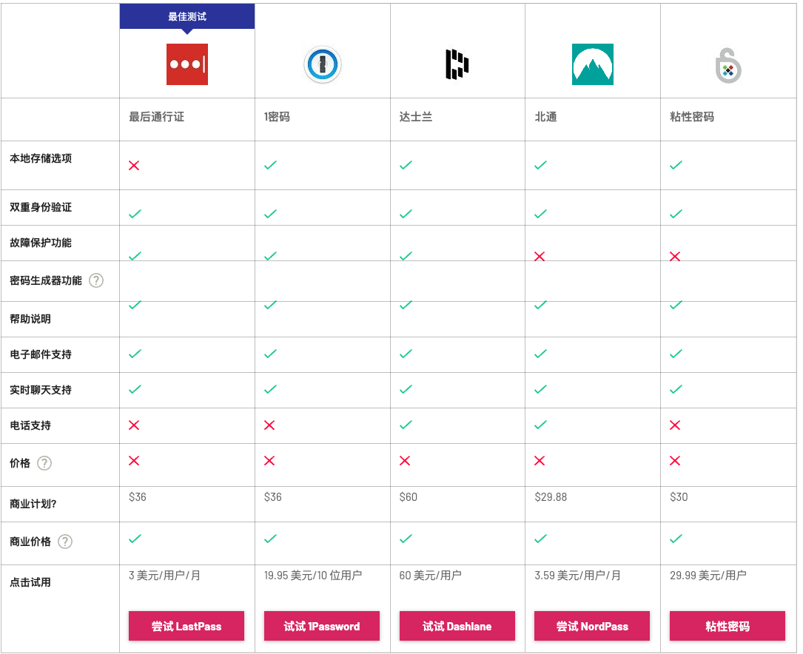

# DID，元宇宙的信用基石

**在DID下，用户成为数字身份系统的中心，而不是以往的应用平台。**
用户可以控制自己的身份数据，允许什么信息被记录，什么信息被谁读取使用，可以跨平台转移使用。一套可以跨越平台的身份记录，使得互联网下一阶段的发展成为可能。

我们认为，DID是元宇宙的信用基石，其解决了互联网目前的发展瓶颈，使得更丰富的数字经济活动能够实现。在现实世界中，身份系统是经济活动发展和社会运行不可缺少的一部分，身份证、学历证书、驾照等凭证证明我们的身份和资质；同时，人们重视自己的社交声誉，而基于身份的信用体系更是金融和商业得以拓展的关键。

数字世界也需要一套有效的身份系统。开放性、公信力、用户控制、隐私，这些都是必不可少的组成。Web2的身份模型的缺陷正在被人们关注，而Web3基于区块链网络的DID尝试，为我们指出了元宇宙数字身份的更可靠的发展路径，以及一个基于DID的数字社会的想象空间。

---
## 一、DID，自我主权身份的必要性

随着互联网应用的普及，身份有了另外一种表现形式————数字身份。一套账号背后是：用户对自我身份的认证、社交网络、用户的行为数据、虚拟资产等等数据资产，这些数据资产随着互联网深入我们的生活而越发重要。

**数字身份模型的问题日益凸显，限制了互联网经济活动更加丰富多元化的发展。**
从最开始，互联网并没有身份层面的原生设计，如何认证用户、保存用户身份数据的任务交给了网站和应用处理。在早期互联网生态复杂度较低的时候，这种孤立的方式比较合适，互联网还没有深度融入经济活动。但如今超过十亿的网民，这种单点登录的方式缺点越发显现。用户名密码依旧是主流范式，用户数据存储在应用的服务器里，而问题主要体现在以下几个方面： 

1. 用户体验与安全性：
**账户密码的模式已经影响到用户体验和安全性。**
由于要为单个服务注册账号密码，当互联网应用快速发展时，用户的账号密码数量会不断累积。据NordPass统计（https://tech.co/password-managers/how-many-passwords-average-person），
平均一个人拥有100个密码，这一数字还在持续上涨。这不仅影响着用户体验，还带来了安全问题。根据Ponemon的统计，53%的人完全依靠自己的记忆来记住密码，而51%的人在工作和个人账户中重复使用相同的密码。用户有着共有密码的习惯，同时大部分人不会经常更新密码，这导致密码在大规模数据泄漏事件中暴露的可能性就越大（例如Collection 1-5事件，在2019年暴露了超过27亿对邮箱密码）。基于此，有大量的商业展开以帮助人们和公司管理琐碎的账户，如Okta、1Password和Dashlane，用户要为自己的账号安全额外买单。

2. 用户对身份的控制权：
在现有模型下，用户并没有真正拥有账户。事实上，是他们从公司和中心化的尸体租赁账户。因此，用户被暴露在数字身份被黑、被操控、被监管、或是丢失的风险。

3. 平台应用间的数据孤岛：
身份数据无法迁移，个人数据分散在不同的平台里。用户需要在不同应用反复填写相似的信息，个人数据分散在不同的平台，随着应用生态复杂度的提高，现有框架难以维系。

而面对这些问题，互联网的发展需要一个新的身份模型。去中心化身份的概念，在Web3时代得益于开源组件的可组合性和加密金融的灵活性，用例和方案正在快速发展。

**根据W3C对DID的定义，DID是一个广泛接受的身份标准，能够保证用户的身份数据可以在不同网络和平台中接入和交互。**
DID架构总览如图。DID是一个标识符，用户能够直接控制和拥有。应用能够发现DID链接的文档，其中包含着身份相关信息。DID文档包含了相关信息，允许用例实现，如签名、数据加密、沟通等。加密签名能够允许个体证明身份标识所有权。

DID使数字身份系统的中心从应用平台转移到了用户，用户拥有并控制着数据身份。在传统模式下，用户的数字身份信息存储在APP中，互不连通，用户依赖平台。而在DID模式下，数字身份信息跟随用户，控制权和灵活性都得到增强。

DID生态可以拆分成几层，每一层都建立在另一层之上。我们依靠并轻微更改了DIF的4层身份模型以映射现有的DID项目，通过他们的目标。值得注意的是，这只是个简化的模型，大部分的项目都超过了一层。

第一层：标识和标准
标准，标识和命名空间创建了公共信任层，确保标准化，便携性，交互性。他们也允许网络记录和管理DID模型，提供开发者和用户关于网络身份的规则和环境

第二层：基础设施
基础设施和代理网络允许应用直接和认证的数据库交互。这些方案包括交流、存储和密钥管理。我们强调Ceramic和ENS是构建DID基础设施的前线。

第三层：证件
证件必须被管理、升级和交换了。这一层目标在于DID如何代表控制和认证，并且安全的在身份用户间传递数据。

第四层：应用、钱包和产品
这一层可能对读者来说最熟悉，这是为了提供现实中的用例并为用户带来价值。一些项目目前使用实体检查但未来会整合DID（如Goldfinch）。

---
## 三、从Web3实践看DID的想象空间

在现实世界中，身份系统是社会良性运作的必不可少的一部分，我们的身份证、学位证书、驾驶证代表着我们的身份和资质，我们小心地对待自己的声誉，这些身份要素让更复杂的社会经济活动得以实现。同样的，数字经济活动的发展，更需要一套完善的数字身份。

在Web3的实践中我们看到了灵魂绑定的出现，NFT作为个人品牌、凭证与权利，链上行为成为了数字画像和声誉，SIWE（以太坊登陆）提供了统一的登陆账号，Defi和社交图谱的创新也在描述用户在数字世界的金融信用和社交关系。这些应用生态慢慢勾勒出了用户的数字形象。

【】

总的来看，这种数字身份是Web2空白的领域。一套用户控制、开放可信的数字身份，为元宇宙提供了有效的活动基础，更大更具想象力的数字经济活动能够实现。

数字画像不再只为商业广告所用，任何人可以通过数字画像找到自己的客户和合作伙伴甚至合伙人，无需中介；创新的社交APP试图改变人与人的连接方式，它可以直接在去中心化的社交图谱上实现；用户花费时间精力构建的数字声誉、形象，不会受到平台应用服务关闭而摧毁。从Web3数字身份的实践中，不难看出这些未来互联网的趋势。

### 1、灵魂绑定与NFT，数字世界的形象、凭证与权利

**SBT（Soulbound token，灵魂绑定通证）是VItalik在最新的博客内容提到的概念，它指的是无法转移的NFT。**
当NFT涉及到身份相关的领域时，可转移性会带来一些麻烦，因此SBT的概念被提出。

“灵魂绑定”这个想法来自于《魔兽世界》，掉落的灵魂绑定物品一旦被拾取，就无法转让或出售给其他玩家。这些装备通常需要完成复杂的任务，或者击败强大的对手，而装备本身除了属性价值，更有一种炫耀自身经历的社交价值。现在的NFT与大型多人在线游戏的史实物品有很多相似之处。它们具有社交价值：拥有它们的人可以炫耀他们，而且越来越多的工具可以帮助用户去展示自己的NFT，比如推特就开始支持在图片资料里展示他们的NFT。

**由于NFT的可交易性，NFT本身的内涵会被淡化，最终都成为财富的信号。**
在一些场景下，获取NFT意味着用户具有某些经历或经历。但由于NFT是可交易的物品，如果有人向你展示他们通过某些经历获得的NFT，你无法判断他们真的经历过这些，还是只是付了些钱。大部分时候这没什么问题，但如果我们想创建一些NFT，用于证明持有者的其他方面，而不仅仅是有钱呢？可转移、可交易的NFT在这种场景下就遇到了困难。

**POAP就是一个适合采用灵魂绑定的典型场景。**
POAP（proof of attendance protocol，出席证明协议），POAP可以让项目发行到场证明，从而证明用户参见过某些事件。比如参与我们之前在Decentraland虚拟总部活动的用户，就可以在现场拿到GSblockchain-POAP。如果有人来观察你的POAP，他们关心的是你的经历，并不关心你是否花钱买这个NFT。以此类推，那些将凭证上链的尝试（如驾照、学历、年龄等）也面临着相似的问题，如果人们可以从别人手中买来凭证，这些证明就没那么有效了。当可转移的NFT已经在艺术品和社区领域有了一席之地，对于不可转移的NFT也有着非常大的未探索空间。

**NFT所代表的治理权可以转移，也会带来麻烦。**
如果治理权能够简单的转移，对治理本身是一件很糟糕的事情。第一，如果目标是将治理权分散，那么转移性增加了中心化风险，因为可以从任何人手里购买治理权。第二，如果目标是让治理权更加有效，那么转移性无法阻止那些不参与治理的人购买获得治理权。

**灵魂绑定的提出意味着NFT已不仅仅是数字资产，还有着更多非资产意义，这些功能需求将NFT的资产性分离。在NFT不断发展出圈的过程中，NFT也越来越多的作为个人品牌、凭证、权限等数字身份的要素，而不仅仅是普通资产。**

NFT已经开始作为个人品牌，就如同传统世界的笔名、知识产权等，也类似传统互联网的账号名称，成为一种个人IP。例如Manifold的创始人@richerd，他拥有者Cryptopunk#6046，并拒绝了950万美元的NFT报价，因为这是他的身份和品牌。相较于传统环境下个人IP的实现，NFT的优势很明显。链上唯一性，能够让IP所有者在无需任何条件下，方式对该IP的侵权，仅仅通过应用就可以验证NFT的所有者。

**NFT是数字世界的钥匙，这一趋势会越发明显。**
NFT从属性上与钥匙类似，应用可以通过NFT识别权限，实现“认物不认人”。在目前的实践中，这一特性多用于社群和服务的访问限制，持有NFT的用户能进入排他性的社群和网站。
随着虚实融合的发展，NFT也将成为线下的数字令牌。

### 2. 链上数据，用户的声誉与画像

**链上数据是行为的可信记录，描述着数字公民的过往经历。**

扩大化的链上画像

社区成员通过活跃的贡献可以在一个DAO里构建他们的声誉，但在下一个环境里他们也可能需要从零开始。DIDs可以保留用户的声望，在多个DAO间打通，就像现实世界一样的身份便携性。更进一步，其它Web3环境，如参加gitcoin、发表mirror或是对radicle代码贡献，都能帮助DAOs找到合适的候选人。

### 3. 以太坊登录，去中心化的大统一账户

**在以太坊登录（SIWE，Sign-in with Ethereum）的模式下，用户通过以太坊私钥签名认证身份，登录应用。**

在这过程中，地址代替账户，私钥代替密码，应用通过地址确定用户身份。钱包成为了Web3的门户，而域名则成为了用户名。

"链接钱包"已经成为了Web3应用的标配，通过以太坊登录，仅需要用户做一个签名认证，不需要gas费。应用通过签名能够确定用户的以太坊地址，通过地址记录用户的身份。对于用户来说，Web3生态快速发展，体验新的应用服务时，无需再注册账户，也不用记忆大量的账号密码并防止泄漏风险。对于应用服务来说，使用SIWE是没有成本的，无需做额外的安全工作，也不会影响用户体验。SIWE与传统的账户密码登录是兼容的，对于不熟悉Web3的用户来说，可以按照习惯操作。

以太坊登录是应用自发探索的路径，因此存在着协议层的瑕疵。每个应用验证签名时传递的信息格式没有规范，同时大部分应用只是通过cookie简单的记录用户的偏好。譬如

SIWE（EIP-4361）是一个完全开放的标准，由Spruce公司在以太坊基金会的支持下推进开发。

- 钱包 Metamask

- 域名

### 4. 信用基石，Defi的下一阶段

抵押借贷是Defi的核心。但因为加密金融协议为实现完全【去信任】【无许可】，经常要求【超额抵押】。比如，从Makerdao借出的贷款，需要130%-170%的抵押率。这加速了DEFI去年的增长，但限制了寻找杠杆的交易者。对大多数人，想借钱的原因是钱不够。

有效的DID系统能够实现信用贷款，从而降低或完全移除抵押推动Defi大规模使用。一个有效的DID层可以允许链上信用，提供基于信用的借贷。更进一步，因为用户直接控制信用分数，他们能直接监视和调整自己的借贷行为。

### 5. 去中心化的社交图谱

## 四、Web3数字身份的挑战

1、隐私

2、安全

3、伪造

## 五、投资建议

1、潜力
2、生态图

